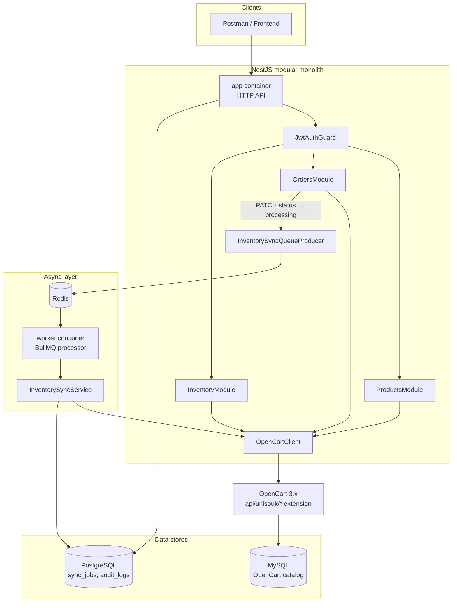
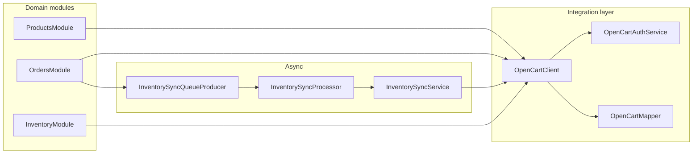
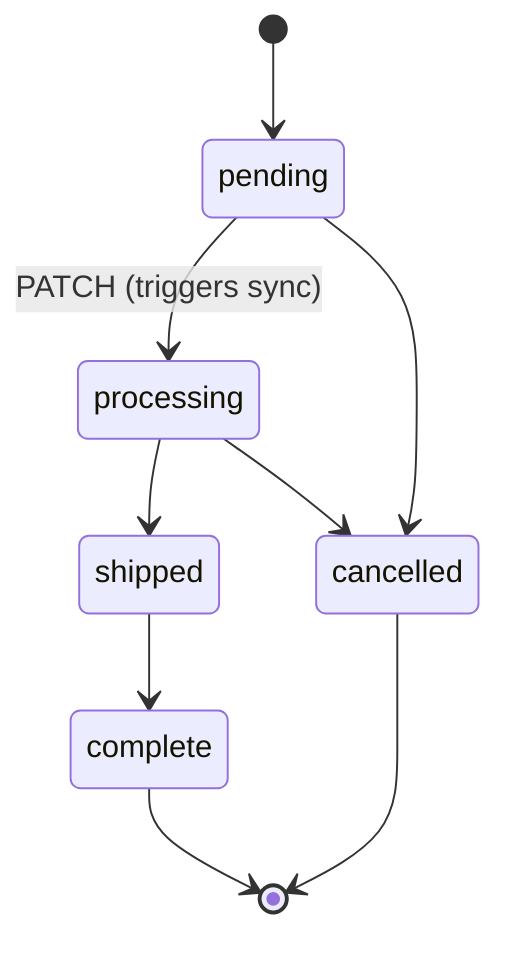
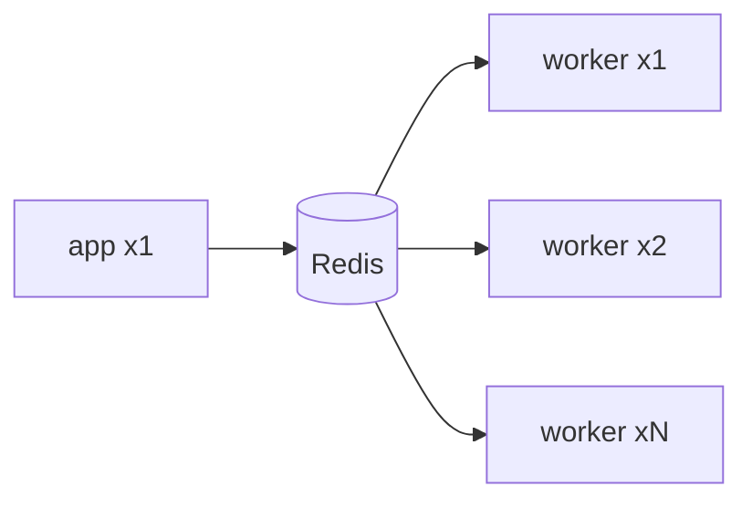
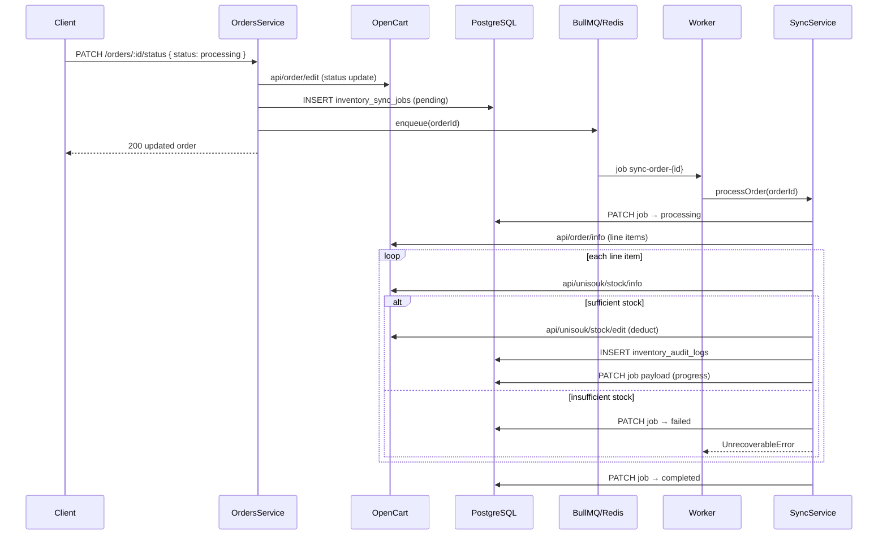

# UniSouk OpenCart Backend

NestJS backend for the **UniSouk Lead Backend Assignment** (Backend Lead Developer). It connects to a running **OpenCart 3.x** store, exposes a JWT-protected REST API under `/api/v1`, and manages **Products**, **Orders**, and **Inventory** with **asynchronous real-time stock sync** when orders move to `processing`.

**Live deployment:** http://187.127.143.11:3002

| Resource | Local (Docker) | Production (VPS) |
| -------- | -------------- | ---------------- |
| API base | http://localhost:3000/api/v1 | http://187.127.143.11:3002/api/v1 |
| Swagger UI | http://localhost:3000/api | http://187.127.143.11:3002/api |
| Health | http://localhost:3000/health | http://187.127.143.11:3002/health |
| OpenCart storefront | http://localhost:8081 | http://187.127.143.11:8081 |
| OpenCart admin | http://localhost:8081/admin | http://187.127.143.11:8081/admin |

**One-command local start:** `docker compose up -d --build`

---

## Assignment deliverables (§6)

This repository satisfies the assignment submission checklist:

| § | Requirement | Location |
| - | ----------- | -------- |
| **6.1** | NestJS + TypeScript codebase | `src/` |
| **6.1** | `docker-compose up --build` full stack | [`docker-compose.yml`](docker-compose.yml) |
| **6.1** | `.env.example` with all variables | [`.env.example`](.env.example) |
| **6.1** | Unit tests for ≥2 core services | `orders.service.spec.ts`, `inventory-sync.service.spec.ts` |
| **6.1** | Swagger at `/api` | http://localhost:3000/api |
| **6.2** | Postman collection v2.1 + env vars + E2E + errors | [`docs/unisouk-assignment.postman_collection.json`](docs/unisouk-assignment.postman_collection.json) |
| **6.3** | README with architecture, setup, sync, tests, limitations | this file |
| **6.4** | OpenCart instance details + seeded products/orders | [`docs/SETUP.md`](docs/SETUP.md) |
| **6.5** | AI tool usage disclosure | [below](#ai-tool-usage-disclosure) |
| — | Live hosted API for testing | http://187.127.143.11:3002 |

---

## What you need to build (assignment summary)

| Module | Capabilities |
| ------ | ------------ |
| **Products** | List, get, create, update, delete; expose option/variant details (name, values, price modifier, stock) |
| **Orders** | List with status/date filters, detail with line items, PATCH status with valid transitions |
| **Inventory** | Read all/single stock, manual adjust, low-stock alerts, **async deduct on order → processing** |

The inventory sync is the critical path: status change is synchronous; stock deduction runs in a **BullMQ worker** so the HTTP response is never blocked.

---

## Tech stack

| Layer | Choice |
| ----- | ------ |
| Framework | NestJS 11 + TypeScript |
| OpenCart | 3.0.3.x (Docker) + custom `api/unisouk/*` PHP extension |
| App database | PostgreSQL + Knex/Objection (sync jobs, audit logs only) |
| OpenCart database | MySQL (catalog, orders, stock — system of record) |
| Async queue | BullMQ + Redis |
| Auth | JWT (`POST /api/v1/auth/login`) |
| API docs | Swagger at `/api` |
| Tests | Jest (unit + e2e smoke) |

---

## Architecture

### System overview



### Module boundaries



| Path | Responsibility |
| ---- | -------------- |
| `src/modules/products/` | Product CRUD + variants (proxied to OpenCart) |
| `src/modules/orders/` | Order list, detail, status PATCH + sync job enqueue |
| `src/modules/inventory/` | Stock read/adjust/alerts + sync service/processor |
| `src/integrations/opencart/` | Auth, HTTP client, retry, mapper, types |
| `src/queues/` | BullMQ module + `inventory-sync` producer |
| `src/database/` | Knex migrations + Objection models for sync/audit tables |
| `src/worker.ts` | Separate Nest bootstrap for the BullMQ worker process |

Domain modules never call axios directly — all OpenCart traffic goes through `OpenCartClient`.

### Order status transitions

Enforced in the API before OpenCart is updated. Only **`processing`** triggers inventory sync.



| From | Allowed to |
| ---- | ---------- |
| `pending` | `processing`, `cancelled` |
| `processing` | `shipped`, `cancelled` |
| `shipped` | `complete` |
| `complete`, `cancelled` | _(terminal)_ |

### Scalable worker deployment

The inventory sync worker runs as a **separate process** (`worker` service / `yarn start:worker`), sharing the codebase but not the HTTP server. You can scale it independently:



```bash
docker compose up -d --scale worker=3
```

---

## Design decisions

### Why a modular monolith?

OpenCart is the system of record for products, orders, and stock. This service adds a **thin orchestration layer**: JWT auth, validation, consistent `{ statusCode, status, data, message }` responses, operational tables for sync auditing, and async stock deduction. Splitting into microservices would add network and deployment overhead without benefit at assignment scale. NestJS modules (`ProductsModule`, `OrdersModule`, `InventoryModule`) keep boundaries clear and match the three assignment modules.

### Why BullMQ?

When an order moves to **`processing`**, stock must be deducted in OpenCart **asynchronously**:

1. OpenCart status update is synchronous (assignment API contract).
2. Stock deduction may involve multiple line items, retries, and partial progress.
3. Failures (e.g. insufficient stock) must be recorded without blocking the HTTP response.

**Alternatives considered:**

| Option | Why not chosen (for this scope) |
| ------ | ------------------------------- |
| Synchronous deduct in PATCH handler | Blocks HTTP; violates assignment async requirement |
| NestJS EventEmitter | In-process only; no persistence, retries, or horizontal worker scaling |
| RabbitMQ / Kafka | Heavier ops for a single assignment deploy; BullMQ + Redis already in stack |
| **BullMQ + Redis** | Retries, backoff, job visibility, separate worker process, scales with `--scale worker=N` |

**Flow:** `OrdersService.updateStatus` → insert `inventory_sync_jobs` row → `InventorySyncQueueProducer.enqueue(orderId)` → BullMQ job → `InventorySyncProcessor` → `InventorySyncService.processOrder` → OpenCart `api/unisouk/stock/edit` per line item + `inventory_audit_logs` writes.

The **worker** runs as a separate Docker service (`worker`) sharing the same codebase as `app` but without the HTTP server — only queue consumers.

---

## REST API overview

All business routes require `Authorization: Bearer <token>` except `POST /api/v1/auth/login`.

### Auth

| Method | Route | Description |
| ------ | ----- | ----------- |
| POST | `/api/v1/auth/login` | Returns JWT (`data.accessToken`) |

### Module 1 — Products

| Method | Route | Description |
| ------ | ----- | ----------- |
| GET | `/api/v1/products` | List products (`page`, `limit`) |
| GET | `/api/v1/products/:id` | Product detail + variants |
| POST | `/api/v1/products` | Create product in OpenCart |
| PUT | `/api/v1/products/:id` | Update product |
| DELETE | `/api/v1/products/:id` | Delete product |
| GET | `/api/v1/products/:id/variants` | Variant listing (option name, value, price modifier, qty) |

### Module 2 — Orders

| Method | Route | Description |
| ------ | ----- | ----------- |
| GET | `/api/v1/orders` | List orders (`status`, `dateFrom`, `dateTo`, `page`, `limit`) |
| GET | `/api/v1/orders/:id` | Order detail + line items |
| PATCH | `/api/v1/orders/:id/status` | Update status; enqueues sync when → `processing` |

### Module 3 — Inventory

| Method | Route | Description |
| ------ | ----- | ----------- |
| GET | `/api/v1/inventory` | All stock levels (paginated) |
| GET | `/api/v1/inventory/:productId` | Single product (+ variant stock) |
| PATCH | `/api/v1/inventory/:productId` | Manual adjust `{ quantity, optionValueId? }` |
| GET | `/api/v1/inventory/alerts` | Products below `LOW_STOCK_THRESHOLD` |

Full OpenCart route mapping: [`docs/opencart-api-notes.md`](docs/opencart-api-notes.md).

---

## Real-time inventory sync (end-to-end)

When an order is confirmed / moves to **`processing`**, the system:

1. Detects the status change via `PATCH /orders/:id/status`.
2. For each line item, deducts ordered quantity from current stock (variant-level when options exist).
3. Writes updated stock back to OpenCart.
4. Handles edge cases without blocking the HTTP response.



### Sync edge cases

| Scenario | Behavior |
| -------- | -------- |
| Stock would go negative | Fail **before** OpenCart write; job → `failed` with `INSUFFICIENT_STOCK`; order stays `processing` in OpenCart |
| OpenCart API fails mid-sync | Exponential backoff (5 attempts); partial progress in job payload + audit logs |
| Duplicate PATCH to `processing` | Unique `order_id` on `inventory_sync_jobs`; completed jobs not re-enqueued |
| Worker crash mid-order | BullMQ redelivery; per-line-item state in payload skips already-deducted lines |
| Variant line item | Deducts `option_value_id` stock, not base product quantity |

**Idempotency:** Completed line items are stored in `inventory_sync_jobs.payload.completedLineItems`. Retries skip already-deducted lines. Jobs with status `completed` are not re-enqueued.

---

## Stack (Docker Compose)

| Service | Purpose | Host URL |
| ------- | ------- | -------- |
| **app** | NestJS HTTP API | http://localhost:3000/api/v1 |
| **worker** | BullMQ inventory-sync consumer | n/a (background) |
| **opencart** | OpenCart 3.0.3.x + UniSouk `api/unisouk/*` extension | http://localhost:8081 |
| **postgres** | App DB (sync jobs, audit logs) | internal |
| **redis** | BullMQ queues | internal |
| **opencart-db** | MySQL for OpenCart | internal |

OpenCart is mapped to **8081** on the host (`8081:80`) to avoid local port clashes.

### Production (AlmaLinux VPS)

Follow **[docs/DEPLOYMENT_TRACKER.md](docs/DEPLOYMENT_TRACKER.md)** — linear checklist, one step at a time.

Quick reference after tracker is complete:

```bash
cp .env.example .env   # set JWT_SECRET, API_PASSWORD_HASH, OPENCART_API_KEY
docker compose -f docker-compose.yml -f docker-compose.prod.yml up -d --build
curl http://187.127.143.11:3002/health
```

---

## Quick start (Docker)

### Prerequisites

- [Docker Desktop](https://www.docker.com/products/docker-desktop/) (includes Compose)
- [Node.js 20+](https://nodejs.org/) and [Yarn](https://yarnpkg.com/) (optional — for local dev without Docker)
- A browser (for one-time OpenCart admin steps)

### 1. Clone and configure

```bash
git clone <repository-url>
cd open_cart_assignment
cp .env.example .env
```

Edit `.env` — at minimum set `OPENCART_API_KEY` after creating the OpenCart API user (see below).

### 2. Build and start

```bash
docker compose up -d --build
```

Wait for healthy services:

```bash
docker compose ps
```

Migrations run automatically when the **app** container starts (`docker/entrypoint.sh`).

### 3. Verify the API

The root path `/` returns 404 by design (global prefix is `/api/v1`).

```bash
curl http://localhost:3000/api/v1
curl http://localhost:3000/health
```

Swagger UI: http://localhost:3000/api

### 4. Obtain a JWT

```bash
curl -X POST http://localhost:3000/api/v1/auth/login \
  -H "Content-Type: application/json" \
  -d '{"username":"admin","password":"admin123"}'
```

Use the returned token: `Authorization: Bearer <token>` on protected routes.

Default dev credentials come from `.env.example` (`API_USER` / bcrypt hash for `admin123`).

---

## OpenCart API credential setup

OpenCart ships as a fresh image. **First run per volume** requires browser steps for install, storage move, and API user creation. Repeat only if you destroy the `opencart_db_data` volume (`docker compose down -v`).

> Compose sets `OPENCART_AUTO_INSTALL=true` with default admin `admin` / `admin123`. If auto-install succeeds, skip the install wizard but still complete **storage move** and **API user** steps.

### Install wizard (if not auto-installed)

1. Open **http://localhost:8081** → install wizard.
2. Database connection — use Docker service names:

| Field | Value |
| ----- | ----- |
| Hostname | `opencart-db` |
| Username | `opencart` |
| Password | `opencart` |
| Database | `opencart` |
| Port | `3306` |

Fallback: `root` / `opencart_root`.

3. Complete admin account setup → **Installation complete**.

### Post-install security

```bash
docker compose exec opencart rm -rf /var/www/html/install
```

In admin (**http://localhost:8081/admin**): accept the **storage move** modal → path `/var/www/` + `storage` → **Move**.

### Create API user

1. **System → Users → API → Add New**
2. Username: `unisouk-api` (match `OPENCART_API_USERNAME`)
3. **Generate** key → copy it
4. **IP Addresses** tab → add `127.0.0.1`; for Docker dev add `0.0.0.0` if IP errors occur
5. **Save**

### Wire Nest to OpenCart

In **`.env`**:

```env
OPENCART_BASE_URL=http://opencart
OPENCART_API_USERNAME=unisouk-api
OPENCART_API_KEY=<paste-generated-key>
```

Restart:

```bash
docker compose up -d app worker
```

### Verify OpenCart login

```bash
curl -X POST "http://localhost:8081/index.php?route=api/login" \
  -d "username=unisouk-api" \
  -d "key=YOUR_API_KEY"
```

Success: JSON includes `"api_token"`.

| Failure | Fix |
| ------- | --- |
| `error.ip` | Add IP to API user allowlist |
| `error.key` | Regenerate key; update `.env`; restart `app` + `worker` |
| HTML install wizard | Complete first-time setup |

### Seed catalog data

In OpenCart admin create **5 products** (≥1 with options/variants) and **3 orders** for integration testing. Seeded IDs and smoke-test commands are documented in **[docs/SETUP.md](docs/SETUP.md)** (assignment §6.4).

### Verify custom extension

```bash
export OC_TOKEN=$(curl -s -X POST "http://localhost:8081/index.php?route=api/login" \
  -d "username=unisouk-api" -d "key=YOUR_API_KEY" | jq -r '.api_token')

curl -s -X POST \
  "http://localhost:8081/index.php?route=api/unisouk/products&api_token=$OC_TOKEN" \
  -d "page=1" -d "limit=20"
```

Pass: `"success": true` with `data.products` — not HTML 404.

---

## OpenCart integration summary

OpenCart 3 **native** API covers login and order read/update. Product CRUD, order list, and stock APIs require the **UniSouk custom PHP extension** baked into the Docker image (`opencart-extension/` → `docker/opencart/Dockerfile`).

| Nest route (JWT) | OpenCart route |
| ---------------- | -------------- |
| `GET/POST/PUT/DELETE /api/v1/products*` | `api/unisouk/products/*` |
| `GET /api/v1/products/:id/variants` | `api/unisouk/products/options` |
| `GET /api/v1/orders` | `api/unisouk/orders` |
| `GET/PATCH /api/v1/orders/:id` | native `api/order/*` |
| `GET/PATCH /api/v1/inventory*` | `api/unisouk/stock/*` |

Rebuild extension after PHP changes:

```bash
docker compose build opencart && docker compose up -d opencart
```

---

## Running without Docker

```bash
yarn install
cp .env.example .env
# Point DATABASE_* at local Postgres; REDIS_HOST=localhost; OPENCART_BASE_URL=http://localhost:8081
yarn migrate:latest
yarn dev          # API
yarn start:worker # BullMQ worker (separate terminal)
```

---

## Testing

Assignment requires **unit tests for at least two core services**. This repo includes regression specs with side-effect assertions (not just `not.toThrow()`):

| Service | Spec | What it proves |
| ------- | ---- | -------------- |
| `OrdersService` | `orders.service.spec.ts` | Enqueues sync when status → `processing`; does **not** enqueue for other transitions |
| `InventorySyncService` | `inventory-sync.service.spec.ts` | Deducts stock with correct qty; **does not** call OpenCart when insufficient stock |

```bash
yarn test              # unit tests
yarn test:cov          # coverage
yarn test:e2e          # health + auth smoke tests
yarn test:ci           # lint + unit tests with coverage (CI command)
```

Targeted runs:

```bash
npx jest --testPathPattern="orders.service.spec.ts"
npx jest --testPathPattern="inventory-sync.service.spec.ts"
```

---

## Postman collection (§6.2)

Import both files into Postman:

- [`docs/unisouk-assignment.postman_collection.json`](docs/unisouk-assignment.postman_collection.json)
- [`docs/unisouk-assignment.postman_environment.json`](docs/unisouk-assignment.postman_environment.json)

Select the **unisouk-assignment** environment, then:

1. Run **Auth → Login** — test script stores `{{token}}` automatically.
2. Run **E2E → Order status → inventory decrement** — PATCH order to `processing`, wait, verify stock decreased.
3. Run **Errors →** folder — 404 product not found, insufficient-stock sync failure.

Environment variables: `{{base_url}}` (default `http://localhost:3000/api/v1`), `{{token}}`, `{{order_id}}`, `{{product_id}}`.

---

## Reviewer setup & seed data (§6.4)

For admin URLs, credentials, API key steps, and the **5 seeded products + 3 seeded orders** table (with IDs and stock quantities), see **[docs/SETUP.md](docs/SETUP.md)**.

Quick inventory sync smoke test (order ID 1):

```bash
# After login + OpenCart API key configured — full steps in SETUP.md
curl -X PATCH "http://localhost:3000/api/v1/orders/1/status" \
  -H "Authorization: Bearer $TOKEN" \
  -H "Content-Type: application/json" \
  -d '{"status":"processing"}'
docker compose logs -f worker
```

---

## Known limitations

| Limitation | Impact |
| ---------- | ------ |
| **Eventual consistency** | Order status updates to `processing` synchronously; stock deduction happens async. A 200 response does not guarantee stock was deducted yet. |
| **No order rollback on sync failure** | If sync fails (e.g. insufficient stock), the order remains `processing` in OpenCart; the sync job is marked `failed`. No automatic status revert. |
| **Manual OpenCart bootstrap** | Install, storage move, API user, and catalog seed are not fully automated (except optional auto-install). |
| **Single API user auth** | Simple JWT login (`API_USER` / password hash) — no multi-tenant RBAC. |
| **OpenCart as source of truth** | No local product/order replica; Postgres only stores sync operational data. |
| **Custom extension dependency** | Product list/CRUD and stock APIs require the UniSouk Docker image; plain OpenCart 3 images will not work for those modules. |
| **Worker co-deployment** | Inventory sync requires the `worker` service (or `yarn start:worker`) running alongside `app`. |

### Future improvements (given more time)

| Area | Improvement |
| ---- | ----------- |
| Sync failure handling | Compensating transaction / saga to revert order status when sync fails after `processing` |
| OpenCart bootstrap | Fully scripted seed (products + orders) via SQL or admin API on first boot |
| Observability | Metrics dashboard for queue depth, sync job failure rate, OpenCart API latency |
| Rate limiting | `@nestjs/throttler` on auth login; BullMQ concurrency tuning per OpenCart capacity |
| Caching | Short-TTL cache for read-heavy product list when OpenCart latency becomes a bottleneck |
| Webhooks | Optional OpenCart order webhook as alternative trigger to PATCH-only flow |

---

## AI tool usage disclosure

This project was developed with assistance from **AI coding tools** (Cursor IDE with Claude) for:

- Implementation planning and commit sequencing (`docs/UNISOUK_OPENCART_COMMIT_TRACKER.md`)
- NestJS module scaffolding, OpenCart client integration, BullMQ wiring, and test specs
- README and documentation drafts

All generated code was reviewed, tested (`yarn test:ci`), and adjusted manually. OpenCart PHP extension logic and assignment-specific business rules were validated against the UniSouk assignment brief and live OpenCart API smoke tests.

---

## Docker commands

```bash
docker compose up -d --build   # build and start
docker compose logs -f app     # API logs
docker compose logs -f worker  # sync worker logs
docker compose down            # stop
docker compose down -v         # reset volumes (re-run OpenCart setup!)
```

---

## Database migrations

```bash
yarn migrate:latest
yarn migrate:rollback
yarn migrate:status
```

---

## Related documentation

| Document | Purpose |
| -------- | ------- |
| [`docs/SETUP.md`](docs/SETUP.md) | Reviewer setup, seeded product/order IDs (§6.4) |
| [`docs/opencart-api-notes.md`](docs/opencart-api-notes.md) | OpenCart version decision, routes, status IDs |
| [`docs/DEPLOYMENT_TRACKER.md`](docs/DEPLOYMENT_TRACKER.md) | Production VPS deployment checklist |
| [`docs/UNISOUK_OPENCART_MANUAL_TESTING_PLAN.md`](docs/UNISOUK_OPENCART_MANUAL_TESTING_PLAN.md) | Manual QA checklist |
| [`opencart-extension/`](opencart-extension/) | UniSouk PHP extension source |

---

## License

UNLICENSED
