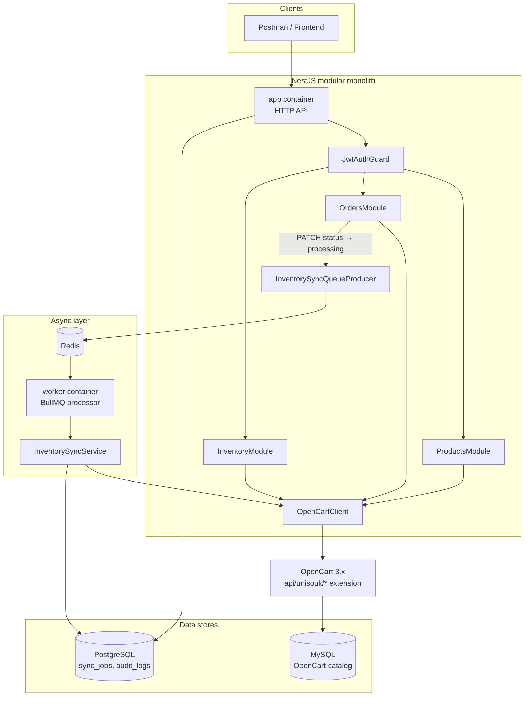
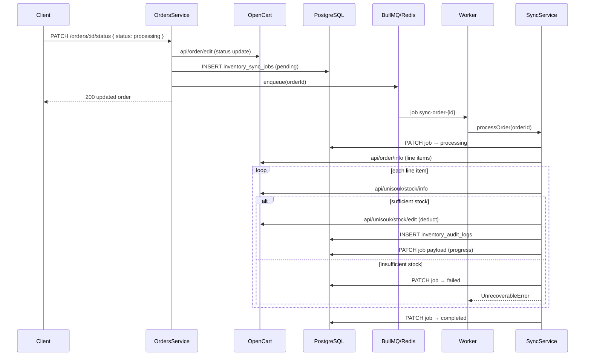

# UniSouk OpenCart Backend

NestJS backend for the **UniSouk Lead Backend Assignment**. It exposes a JWT-protected REST API under `/api/v1`, persists operational data (sync jobs, audit logs) in PostgreSQL, uses Redis + BullMQ for async inventory deduction, and integrates with **OpenCart 3.x** for catalog, orders, and stock.

**Live deployment:** _TBD — filled in during C-29_

| Resource | URL |
| -------- | --- |
| API base | http://localhost:3000/api/v1 |
| Swagger UI | http://localhost:3000/api |
| OpenCart storefront | http://localhost:8081 |
| OpenCart admin | http://localhost:8081/admin |

---

## Architecture



### Module layout

| Path | Responsibility |
| ---- | -------------- |
| `src/modules/products/` | Product CRUD + variants (proxied to OpenCart) |
| `src/modules/orders/` | Order list, detail, status PATCH + sync job enqueue |
| `src/modules/inventory/` | Stock read/adjust/alerts + sync service/processor |
| `src/integrations/opencart/` | Auth, HTTP client, retry, mapper, types |
| `src/queues/` | BullMQ module + `inventory-sync` producer |
| `src/database/` | Knex migrations + Objection models for sync/audit tables |
| `src/worker.ts` | Separate Nest bootstrap for the BullMQ worker process |

Domain modules never call axios directly — all OpenCart traffic goes through `OpenCartClient`.

---

## Design decisions

### Why a modular monolith?

OpenCart is the system of record for products, orders, and stock. This service adds a **thin orchestration layer**: JWT auth, validation, consistent `{ statusCode, status, data, message }` responses, operational tables for sync auditing, and async stock deduction. Splitting into microservices would add network and deployment overhead without benefit at assignment scale. NestJS modules (`ProductsModule`, `OrdersModule`, `InventoryModule`) keep boundaries clear and match the three assignment modules.

### Why BullMQ?

When an order moves to **`processing`**, stock must be deducted in OpenCart **asynchronously**:

1. OpenCart status update is synchronous (assignment API contract).
2. Stock deduction may involve multiple line items, retries, and partial progress.
3. Failures (e.g. insufficient stock) must be recorded without blocking the HTTP response.

**Flow:** `OrdersService.updateStatus` → insert `inventory_sync_jobs` row → `InventorySyncQueueProducer.enqueue(orderId)` → BullMQ job → `InventorySyncProcessor` → `InventorySyncService.processOrder` → OpenCart `api/unisouk/stock/edit` per line item + `inventory_audit_logs` writes.

The **worker** runs as a separate Docker service (`worker`) sharing the same codebase as `app` but without the HTTP server — only queue consumers.

---

## Inventory sync (end-to-end)



**Idempotency:** Completed line items are stored in `inventory_sync_jobs.payload.completedLineItems`. Retries skip already-deducted lines. Jobs with status `completed` are not re-enqueued.

**Status transitions** (enforced in API before OpenCart update):

| From | Allowed to |
| ---- | ---------- |
| `pending` | `processing`, `cancelled` |
| `processing` | `shipped`, `cancelled` |
| `shipped` | `complete` |
| `complete`, `cancelled` | _(terminal)_ |

Only **`processing`** triggers inventory sync.

---

## Stack (Docker Compose)

| Service | Purpose | Host URL |
| ------- | ------- | -------- |
| **app** | NestJS HTTP API | http://localhost:3000/api/v1 |
| **worker** | BullMQ inventory-sync consumer | n/a (background) |
| **opencart** | OpenCart 3.0.3.x + UniSouk `api/unisouk/*` extension | http://localhost:8081 |
| **postgres** | App DB (sync jobs, audit logs) | internal |
| **redis** | BullMQ queues | internal |
| **opencart-db** | MySQL for OpenCart | internal |

OpenCart is mapped to **8081** on the host (`8081:80`) to avoid local port clashes.

---

## Quick start (Docker)

### Prerequisites

- [Docker Desktop](https://www.docker.com/products/docker-desktop/) (includes Compose)
- [Node.js 20+](https://nodejs.org/) and [Yarn](https://yarnpkg.com/) (optional — for local dev without Docker)
- A browser (for one-time OpenCart admin steps)

### 1. Clone and configure

```bash
git clone <repository-url>
cd open_cart_assignment
cp .env.example .env
```

Edit `.env` — at minimum set `OPENCART_API_KEY` after creating the OpenCart API user (see below).

### 2. Build and start

```bash
docker compose up -d --build
```

Wait for healthy services:

```bash
docker compose ps
```

Migrations run automatically when the **app** container starts (`docker/entrypoint.sh`).

### 3. Verify the API

The root path `/` returns 404 by design (global prefix is `/api/v1`).

```bash
curl http://localhost:3000/api/v1
curl http://localhost:3000/health
```

Swagger UI: http://localhost:3000/api

### 4. Obtain a JWT

```bash
curl -X POST http://localhost:3000/api/v1/auth/login \
  -H "Content-Type: application/json" \
  -d '{"username":"admin","password":"admin123"}'
```

Use the returned token: `Authorization: Bearer <token>` on protected routes.

Default dev credentials come from `.env.example` (`API_USER` / bcrypt hash for `admin123`).

---

## OpenCart API credential setup

OpenCart ships as a fresh image. **First run per volume** requires browser steps for install, storage move, and API user creation. Repeat only if you destroy the `opencart_db_data` volume (`docker compose down -v`).

> Compose sets `OPENCART_AUTO_INSTALL=true` with default admin `admin` / `admin123`. If auto-install succeeds, skip the install wizard but still complete **storage move** and **API user** steps.

### Install wizard (if not auto-installed)

1. Open **http://localhost:8081** → install wizard.
2. Database connection — use Docker service names:

| Field | Value |
| ----- | ----- |
| Hostname | `opencart-db` |
| Username | `opencart` |
| Password | `opencart` |
| Database | `opencart` |
| Port | `3306` |

Fallback: `root` / `opencart_root`.

3. Complete admin account setup → **Installation complete**.

### Post-install security

```bash
docker compose exec opencart rm -rf /var/www/html/install
```

In admin (**http://localhost:8081/admin**): accept the **storage move** modal → path `/var/www/` + `storage` → **Move**.

### Create API user

1. **System → Users → API → Add New**
2. Username: `unisouk-api` (match `OPENCART_API_USERNAME`)
3. **Generate** key → copy it
4. **IP Addresses** tab → add `127.0.0.1`; for Docker dev add `0.0.0.0` if IP errors occur
5. **Save**

### Wire Nest to OpenCart

In **`.env`**:

```env
OPENCART_BASE_URL=http://opencart
OPENCART_API_USERNAME=unisouk-api
OPENCART_API_KEY=<paste-generated-key>
```

Restart:

```bash
docker compose up -d app worker
```

### Verify OpenCart login

```bash
curl -X POST "http://localhost:8081/index.php?route=api/login" \
  -d "username=unisouk-api" \
  -d "key=YOUR_API_KEY"
```

Success: JSON includes `"api_token"`.

| Failure | Fix |
| ------- | --- |
| `error.ip` | Add IP to API user allowlist |
| `error.key` | Regenerate key; update `.env`; restart `app` + `worker` |
| HTML install wizard | Complete first-time setup |

### Seed catalog data

In OpenCart admin create **5 products** (≥1 with options/variants) and **3 orders** for integration testing. Entity IDs will be documented in `docs/SETUP.md` (C-27).

### Verify custom extension

```bash
export OC_TOKEN=$(curl -s -X POST "http://localhost:8081/index.php?route=api/login" \
  -d "username=unisouk-api" -d "key=YOUR_API_KEY" | jq -r '.api_token')

curl -s -X POST \
  "http://localhost:8081/index.php?route=api/unisouk/products&api_token=$OC_TOKEN" \
  -d "page=1" -d "limit=20"
```

Pass: `"success": true` with `data.products` — not HTML 404.

---

## OpenCart integration summary

OpenCart 3 **native** API covers login and order read/update. Product CRUD, order list, and stock APIs require the **UniSouk custom PHP extension** baked into the Docker image (`opencart-extension/` → `docker/opencart/Dockerfile`).

| Nest route (JWT) | OpenCart route |
| ---------------- | -------------- |
| `GET/POST/PUT/DELETE /api/v1/products*` | `api/unisouk/products/*` |
| `GET /api/v1/products/:id/variants` | `api/unisouk/products/options` |
| `GET /api/v1/orders` | `api/unisouk/orders` |
| `GET/PATCH /api/v1/orders/:id` | native `api/order/*` |
| `GET/PATCH /api/v1/inventory*` | `api/unisouk/stock/*` |

Full route catalog: [`docs/opencart-api-notes.md`](docs/opencart-api-notes.md).

Rebuild extension after PHP changes:

```bash
docker compose build opencart && docker compose up -d opencart
```

---

## Running without Docker

```bash
yarn install
cp .env.example .env
# Point DATABASE_* at local Postgres; REDIS_HOST=localhost; OPENCART_BASE_URL=http://localhost:8081
yarn migrate:latest
yarn dev          # API
yarn start:worker # BullMQ worker (separate terminal)
```

---

## Testing

```bash
yarn test              # unit tests
yarn test:cov          # coverage
yarn test:e2e          # health + auth smoke tests
yarn test:ci           # lint + unit tests with coverage (CI command)
```

Postman collection: added in C-28.

---

## Known limitations

| Limitation | Impact |
| ---------- | ------ |
| **Eventual consistency** | Order status updates to `processing` synchronously; stock deduction happens async. A 200 response does not guarantee stock was deducted yet. |
| **No order rollback on sync failure** | If sync fails (e.g. insufficient stock), the order remains `processing` in OpenCart; the sync job is marked `failed`. No automatic status revert. |
| **Manual OpenCart bootstrap** | Install, storage move, API user, and catalog seed are not fully automated (except optional auto-install). |
| **Single API user auth** | Simple JWT login (`API_USER` / password hash) — no multi-tenant RBAC. |
| **OpenCart as source of truth** | No local product/order replica; Postgres only stores sync operational data. |
| **Custom extension dependency** | Product list/CRUD and stock APIs require the UniSouk Docker image; plain OpenCart 3 images will not work for those modules. |
| **Worker co-deployment** | Inventory sync requires the `worker` service (or `yarn start:worker`) running alongside `app`. |

---

## AI tool usage disclosure

This project was developed with assistance from **AI coding tools** (Cursor IDE with Claude) for:

- Implementation planning and commit sequencing (`docs/UNISOUK_OPENCART_COMMIT_TRACKER.md`)
- NestJS module scaffolding, OpenCart client integration, BullMQ wiring, and test specs
- README and documentation drafts

All generated code was reviewed, tested (`yarn test:ci`), and adjusted manually. OpenCart PHP extension logic and assignment-specific business rules were validated against the UniSouk assignment brief and live OpenCart API smoke tests.

---

## Docker commands

```bash
docker compose up -d --build   # build and start
docker compose logs -f app     # API logs
docker compose logs -f worker  # sync worker logs
docker compose down            # stop
docker compose down -v         # reset volumes (re-run OpenCart setup!)
```

---

## Database migrations

```bash
yarn migrate:latest
yarn migrate:rollback
yarn migrate:status
```

---

## Related documentation

| Document | Purpose |
| -------- | ------- |
| [`docs/opencart-api-notes.md`](docs/opencart-api-notes.md) | OpenCart version decision, routes, status IDs |
| [`docs/SETUP.md`](docs/SETUP.md) | Seeded product/order IDs _(C-27)_ |
| [`docs/UNISOUK_OPENCART_MANUAL_TESTING_PLAN.md`](docs/UNISOUK_OPENCART_MANUAL_TESTING_PLAN.md) | Manual QA checklist |
| [`opencart-extension/`](opencart-extension/) | UniSouk PHP extension source |

---

## License

UNLICENSED
